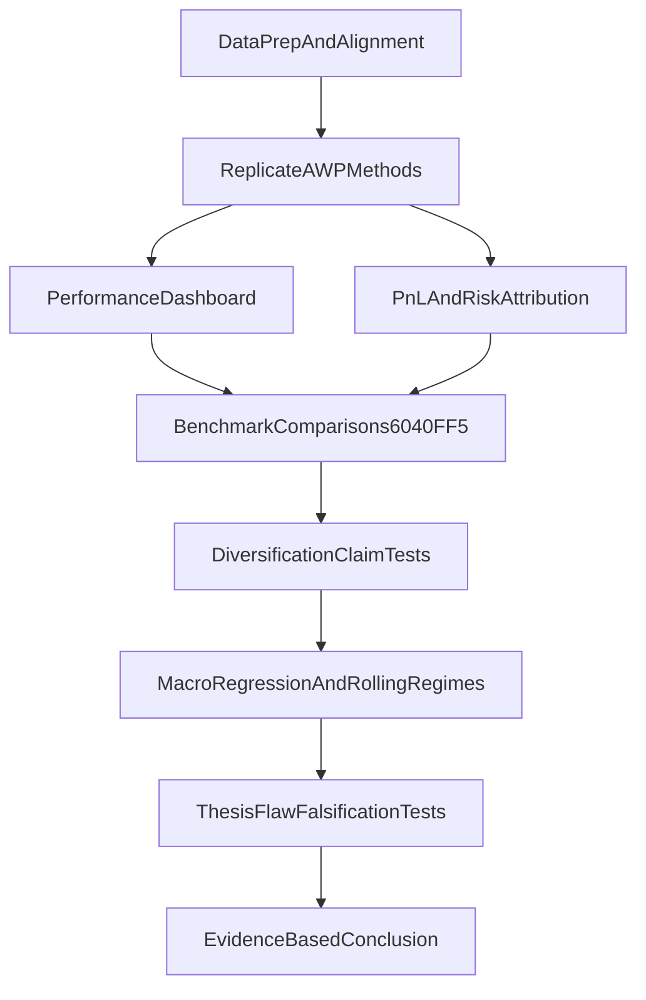

# All Weather Portfolio Replication and Evaluation Plan

## Scope Locked

- Replication baseline: core 5-asset All Weather universe only (`SPY`, `TLT`, `IEF`, `GLD`, `DBC`).
- Macro model: use exact thesis indicator set first, then add extra variables to test whether the thesis omitted important drivers.
- **Deliverable**: a **new** notebook in `final/ben/` (suggested name: `awp_replication_analysis.ipynb`) that follows the section order in this plan end-to-end.
- **Scratch / prior risk tests**: [ben_awp.ipynb](F:/Document/GitHub/fina4359-quant-trading/final/ben/ben_awp.ipynb) is optional reference only; do not treat it as the final submission vehicle unless you merge results back deliberately.
- Reference methodology: [F:/Document/GitHub/fina4359-quant-trading/final/ben/andy_summary.md](F:/Document/GitHub/fina4359-quant-trading/final/ben/andy_summary.md)

## Replication Blueprint (match teammate approach)

- **Data handling**
  - Use adjusted close total-return prices.
  - Keep overlapping sample where all 5 assets exist.
  - Compute daily returns, annualization with 252 trading days.
- **Portfolio definitions**
  - `AWP_fixed`: Dalio-style fixed weights `30/40/15/7.5/7.5` for `SPY/TLT/IEF/GLD/DBC`.
  - `AWP_invvol_static`: inverse-vol static weights from full-sample annualized vol (`w_i proportional to 1/vol_i`, normalized to sum to 1).
  - `AWP_invvol_dynamic`: rolling inverse-vol (252-day lookback), rebalance monthly / semiannual / annual for robustness.
- **Replication checks**
  - Validate weight sum and non-negative constraints.
  - Confirm returns are computed from lagged weights (avoid look-ahead).
  - Match teammate’s reported metric style and chart style where possible.

## Basic Performance Analysis

- Compute and compare: cumulative growth of $1, CAGR, annualized vol, Sharpe, Sortino, max drawdown, Calmar, monthly hit ratio.
- Add rolling diagnostics: 12m rolling return, 12m rolling vol, 12m rolling Sharpe, rolling max drawdown.
- Report whole-sample and key subperiods (pre-COVID, COVID shock, 2022 inflation/rates shock, latest period).

## PnL and Risk Attribution + Benchmarks

- **PnL attribution**
  - Arithmetic contribution by asset (`weight_{t-1} * return_t`) and cumulative contribution share.
  - Regime split attribution (bull/bear equity months; high/low inflation windows).
- **Risk attribution**
  - Volatility contribution using covariance decomposition (marginal + component risk).
  - Tail risk contribution (Expected Shortfall contribution) to assess crisis protection claims.
- **Benchmarks**
  - `60/40`: `60% SPY + 40% (IEF/TLT blend)` for duration-balanced bond sleeve.
  - `FF5`: time-series regression of portfolio excess returns on `MKT, SMB, HML, RMW, CMA`.

## Diversification/Protection Claim Tests

- Rolling correlation matrix and average pairwise correlation.
- Concentration tests: Herfindahl of weights and PCA variance share of first component.
- Factor concentration: rolling FF5 betas and rolling R-squared.
- Drawdown co-movement: which assets actually hedge in left-tail months.
- Conclusion rule: “diversified” only if both asset-level and factor-level concentration remain low across regimes.

## Macro Indicator Exposure and Regime Analysis

- Phase 1: regress portfolio returns on thesis macro indicators exactly as specified in your thesis.
- Phase 2 (debunk extension): augment model with omitted variables (e.g., term premium proxies, real-rate shifts, dollar/liquidity proxies, volatility/risk-aversion proxies).
- Run static + rolling regressions (e.g., 36M/60M windows) to show regime-dependent sign/strength changes.
- Compare explanatory power lift (adjusted R², out-of-sample fit, coefficient stability) between thesis-only vs thesis-plus models.

## Thesis Flaw Tests (high-value falsification checks)

- Start-date / end-date sensitivity (results driven by lucky sample window).
- Parameter stability (inverse-vol lookback 126/252/504; rebalance frequency dependence).
- 2022-style bond-equity correlation flip test (core AWP vulnerability).
- Cost realism (transaction costs + slippage impact on dynamic rebalancing).
- Multiple-testing guardrails (predefine metrics before comparing many variants).
- Data-quality checks (ETF inception overlap, missing data handling, survivorship bias).

## Workflow Map

## Output Structure

- **Create** the deliverable notebook at [F:/Document/GitHub/fina4359-quant-trading/final/ben/awp_replication_analysis.ipynb](F:/Document/GitHub/fina4359-quant-trading/final/ben/awp_replication_analysis.ipynb) (filename may be adjusted, but it must be a new file dedicated to this plan).
- Structure it with markdown headings that mirror the plan: Replication, Performance, PnL/Risk + Benchmarks (60/40, FF5), Diversification tests, Macro regressions, Thesis-falsification checks, Short conclusion.
- Reuse data paths, imports, and any reusable snippets from [ben_awp.ipynb](F:/Document/GitHub/fina4359-quant-trading/final/ben/ben_awp.ipynb) by copy or refactor; avoid leaving the final analysis only in the scratch notebook.
- Optional: add a short results summary markdown (same folder) after the notebook is complete, in the style of [andy_summary.md](F:/Document/GitHub/fina4359-quant-trading/final/ben/andy_summary.md), only if the course asks for a separate write-up.

