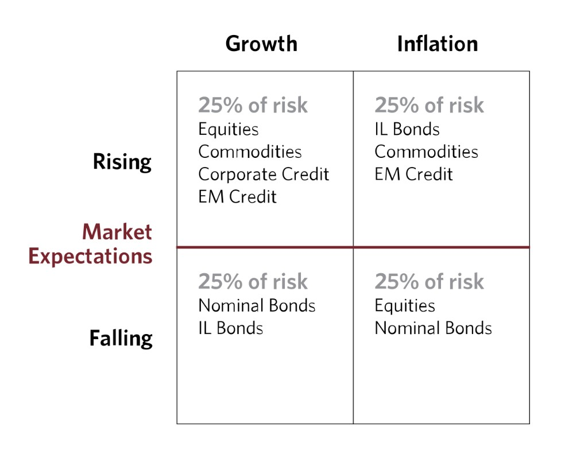
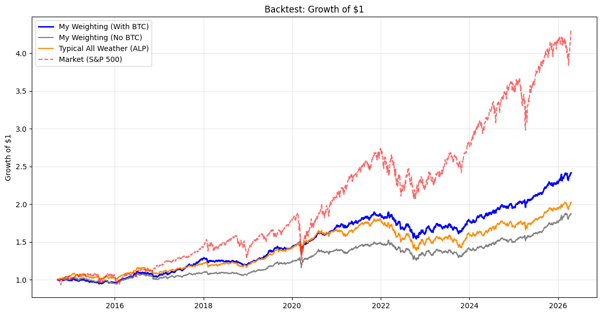
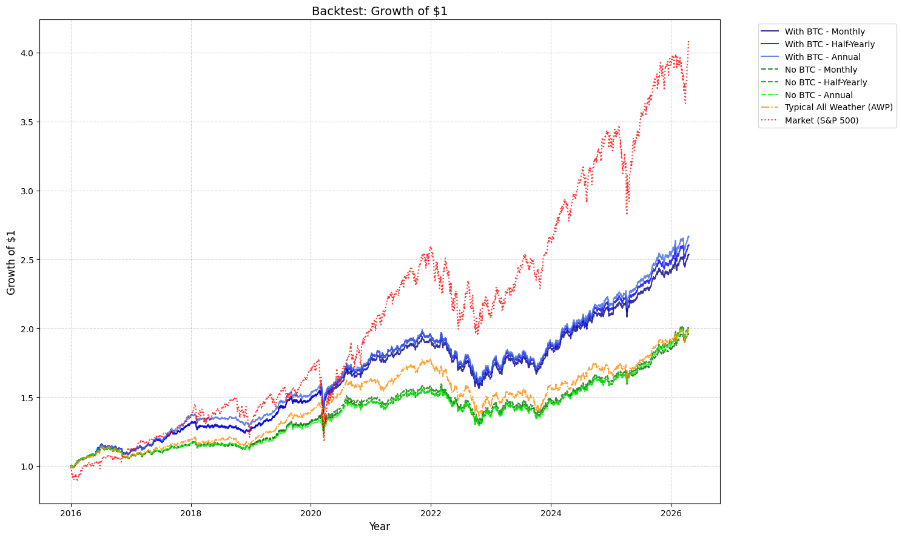
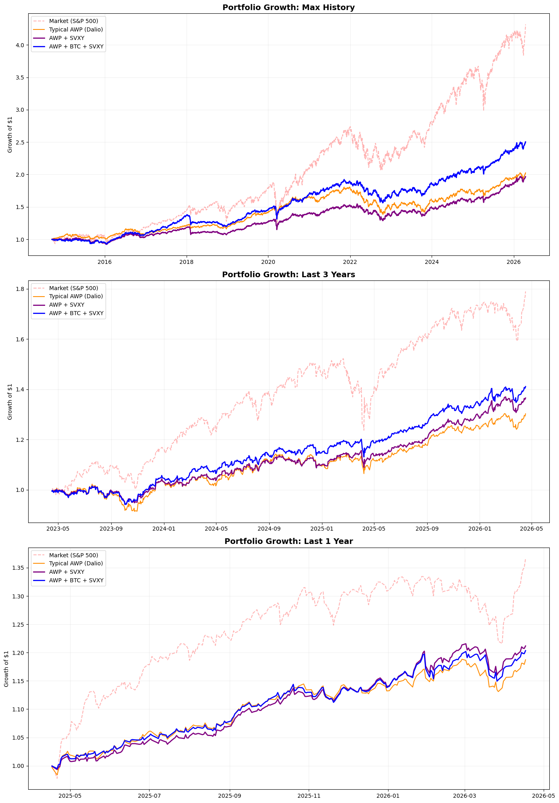
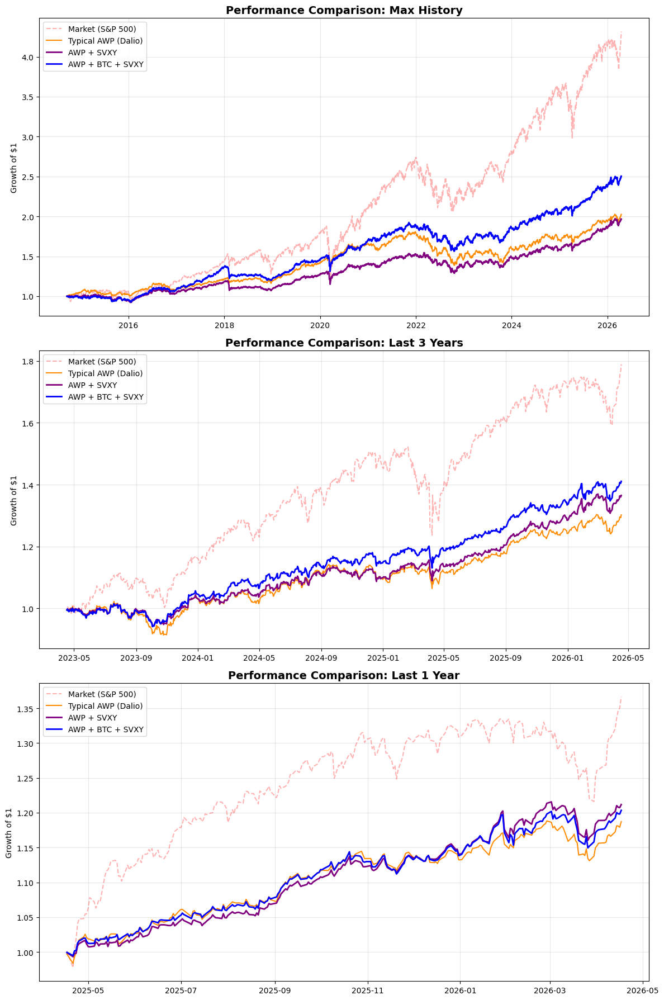

# FINA4359 Notebook Analysis Summary

## All Weather Portfolio Idea and Origin

The **All Weather Portfolio** is built around one core idea: instead of trying to predict the next macro regime, hold a balanced mix of assets that can perform across different economic environments.  
In practice, the framework balances exposure to the two major macro drivers:

- **Growth** (rising vs falling relative to expectations)
- **Inflation** (rising vs falling relative to expectations)

This gives four possible "weather" states (growth up/down x inflation up/down). The portfolio is then designed so no single state dominates total portfolio risk, which is why the approach is closely linked to **risk parity** and inverse-volatility style sizing.

### Where Ray Dalio first had the idea

- The conceptual seed came from Ray Dalio's macro learning process after the **1971 Nixon shock** (end of dollar-gold convertibility), which pushed him to think in recurring cause-effect economic patterns rather than one-off events.
- The **fully formed All Weather strategy was launched in 1996** at Bridgewater by Ray Dalio with Bob Prince, Greg Jensen, Dan Bernstein and colleagues.
- It was **originally created for Ray Dalio's trust assets**, before broader institutional adoption.

### Primary source

- Bridgewater Associates, *The All Weather Story* (January 2012):  
  [https://www.bridgewater.com/research-and-insights/the-all-weather-story](https://www.bridgewater.com/research-and-insights/the-all-weather-story)

## Data and Setup

- Asset universe: `SPY`, `GLD`, `DBC`, `IEF`, `TLT`, `SVXY`, and `BTC-USD` (renamed to `BTC`).
- Data source: `yfinance`, downloaded with `auto_adjust=True` so prices are total-return adjusted.
- File created and used for analysis: `FINA4359 database +btc.csv`.
- Effective sample starts in 2014 (after dropping missing rows so all assets are available).

## Method

The notebook goes through a few strategy design stages:

1. **Build the dataset**
   - Download daily adjusted close data.
   - Keep common overlap dates across all assets.
   - Save clean panel to CSV.

2. **Baseline risk-parity weights (static inverse-volatility)**
   - Compute daily returns.
   - Annualize each asset's volatility with `std * sqrt(252)`.
   - Use inverse-volatility weights: `w_i \u221d 1/vol_i`.

3. **Compare static portfolios**
   - **My Weighting (With BTC)**: inverse-vol across 6 assets.
   - **My Weighting (No BTC)**: inverse-vol across 5 core assets.
   - **Typical All Weather (Dalio template)**: fixed 30/40/15/7.5/7.5 split (stocks/long bonds/intermediate bonds/gold/commodities).
   - **Market benchmark**: SPY only.
   - Evaluate growth of $1, annualized return, annualized volatility, and Sharpe ratio.

4. **Dynamic rebalancing test**
   - Rolling lookback window: 252 trading days.
   - Rebalance frequencies tested: Monthly, Half-Yearly, Annual.
   - Run both **with BTC** and **no BTC**, then compare against Typical AWP and SPY.

5. **SVXY extension**
   - Add `SVXY` as an additional diversifier.
   - Compare:
     - Typical AWP (fixed weights),
     - AWP + SVXY (risk parity),
     - AWP + BTC + SVXY (risk parity),
     - Market (SPY).
   - Plot across full history, last 3 years, and last 1 year.

## Key Results

### Initial full-history asset risk and static weights

- Annualized volatility by asset (approx):  
  SPY 17.62%, GLD 15.91%, DBC 17.83%, IEF 6.57%, TLT 14.86%, BTC 66.50%.
- Resulting inverse-vol weights (approx):  
  SPY 13.83%, GLD 15.32%, DBC 13.67%, IEF 37.11%, TLT 16.40%, BTC 3.67%.
- Interpretation: BTC gets a small allocation due to very high volatility; bonds (especially IEF) dominate risk-parity weight.

### Dynamic rebalancing comparison (printed metrics)

- **With BTC - Annual rebalance**: Return 9.98%, Vol 7.78%, Sharpe 1.28 (best Sharpe in this block).
- **With BTC - Half-Yearly**: Return 9.73%, Vol 7.69%, Sharpe 1.27.
- **With BTC - Monthly**: Return 9.45%, Vol 7.65%, Sharpe 1.23.
- **No BTC strategies**: Returns around 6.75%-6.98%, Sharpe around 0.94-0.96.
- **Typical AWP**: Return 6.90%, Vol 8.68%, Sharpe 0.80.
- **Market (SPY)**: Return 14.60%, Vol 17.92%, Sharpe 0.81.

### SVXY + BTC extension (full-history summary)

- Market (SPY): Return 13.46%, Vol 17.63%, Sharpe 0.76.
- Typical AWP (Dalio): Return 6.29%, Vol 8.51%, Sharpe 0.74.
- AWP + SVXY: Return 6.02%, Vol 7.65%, Sharpe 0.79.
- **AWP + BTC + SVXY**: Return 8.25%, Vol 8.06%, **Sharpe 1.02** (best risk-adjusted result in this block).

Risk-parity weights for **AWP + BTC + SVXY**:

- SPY 13.24%
- GLD 14.67%
- DBC 13.09%
- IEF 35.52%
- TLT 15.70%
- SVXY 4.28%
- BTC 3.51%

## Plot Summary

The notebook generates several cumulative growth charts (`(1+r).cumprod()`).  
The extracted figures are embedded below.

### 1) Static Strategy Comparison

Compares:
- My Weighting (With BTC)
- My Weighting (No BTC)
- Typical AWP
- Market (SPY)

### 2) Static Comparison (refined version)

Same strategy set with adjusted styling and labels.

### 3) Dynamic Rebalancing (8 Scenarios)

Overlays:
- With BTC (Monthly / Half-Yearly / Annual)
- No BTC (Monthly / Half-Yearly / Annual)
- Typical AWP
- Market (SPY)

This plot visually supports stronger risk-adjusted performance for BTC-inclusive dynamic variants.

### 4) Multi-Timeframe: AWP vs SVXY/BTC Extensions (Version 1)

Three panels:
- Max History
- Last 3 Years
- Last 1 Year

Each panel compares Market, Typical AWP, AWP + SVXY, and AWP + BTC + SVXY.

### 5) Multi-Timeframe: AWP vs SVXY/BTC Extensions (Version 2)

Final formatted version of the same three-window comparison used with the final metrics table.

## Overall Takeaway

- In this notebook's tests, adding **BTC** (small risk-parity weight) improves risk-adjusted performance versus no-BTC versions.
- Adding **SVXY + BTC** to an all-weather-style allocation produces the strongest full-history Sharpe among the tested portfolio variants.
- The market benchmark still has the highest raw return, but with materially higher volatility and lower Sharpe than the best diversified strategy.
